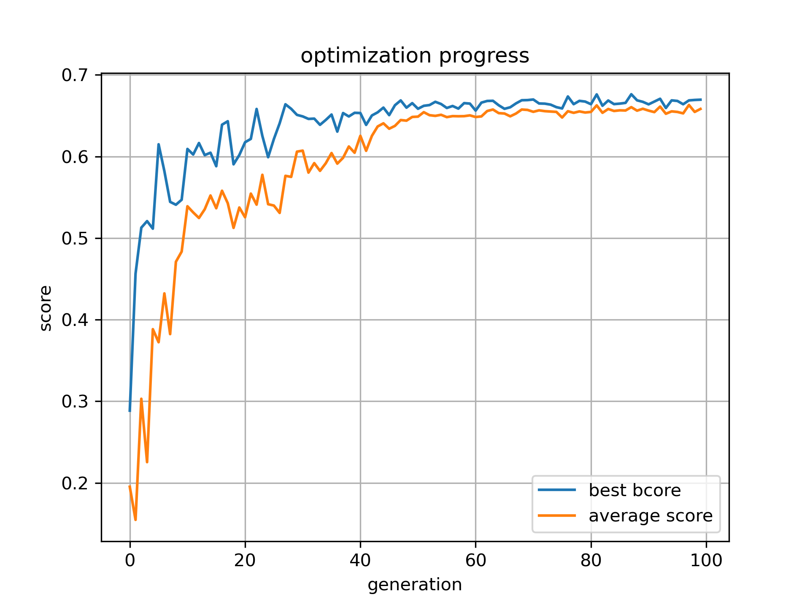
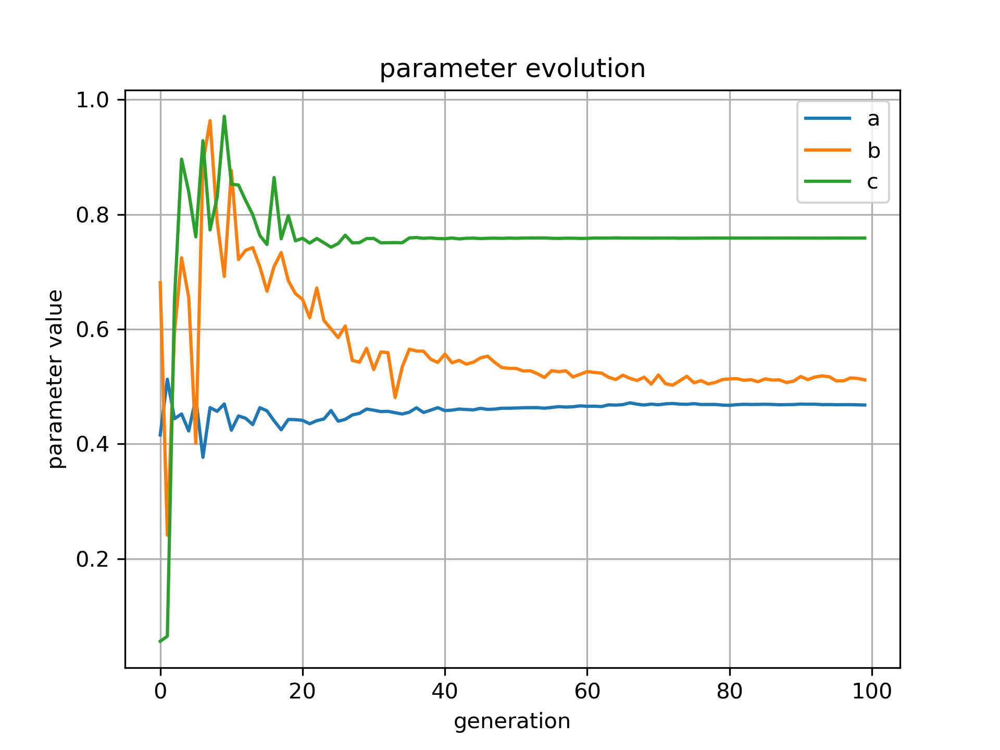

# Quadratic Sinusoidal Taper Optimization

#### cmaes optimization of taper inspired from IISC paper: https://arxiv.org/pdf/1705.01698

#### taper length has been reduced to 10 micron to see if the cmaes algo may be able to find any geometry with excellent transmission

#### The goal is to automatically discover taper parameters that maximize **mode transmission efficiency**

---

#### parameters:
    The coefficient a controls the fraction of the sinusoidal as well as the parabolic component
    The parameter b controls the parabolic curvature of the baseline
    The parameter c controls the number of full oscillations of the sinusoidal component part of the taper

---

#### the optimization log:
#### transmission score vs generation



this plot shows how the objective function (mode transmission) improves across CMA-ES generations.

---

#### parameter evolution



evolution of the taper parameters during optimization.

---

#### Repository Structure

```
quadratic-sinusoidal-taper/
├── cmaes_opt.py                  # CMA-ES optimization loop
├── cmaes_opt_mt.py               # multithreading parallel version
├── tp.py                         # meep fdtd simulation
├── plot.py                       # visualization of optimization log
├── history.json                  # optimization history
├── optimized_geometry.png        # optimized geometry
├── scores-vs-generation.png
└── parameters-vs-generation.png

```
